# Malware Analysis Report
> **Dynamic Analysis of AgentTesla Executed via Malicious Archive**

**Date:** 9 September 2026.
**Analyst:** Jeanne Septiani L. Toruan
**Environment:** ANY.RUN Cloud Sandbox

---

## 1. File Information & Threat Verdict

Berdasarkan hasil eksekusi dinamis di dalam lingkungan *sandbox* yang terisolasi, sampel ini terdeteksi melakukan aktivitas yang sangat berbahaya dan diklasifikasikan sebagai *Malicious*.

| Attribute | Details |
| :--- | :--- |
|**Filename** | `Comprobante de pago BBVA.rar` |
|**Threat Verdict** | **Malicious** (Score: 100/100) |
|**Malware Family** | AgentTesla (Stealer) |
|**Target OS** | Windows 10 (64-bit) |
|**Identified Tags** | `agenttesla`, `stealer`, `evasion`, `ftp` |

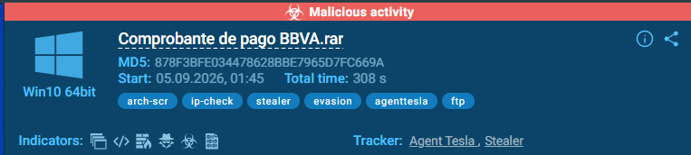

## 2. Executive Summary

Sampel `Comprobante de pago BBVA.rar` dieksekusi di dalam lingkungan *sandbox* terisolasi dan segera menunjukkan rantai infeksi berlapis yang sangat terstruktur, berujung pada aktivitas pencurian data (*stealer*).

> **Threat Context & Social Engineering:**
> Serangan ini sangat mengandalkan manipulasi psikologis dengan memancing korban menggunakan file bernama `Comprobante de pago BBVA.rar` (Bukti Pembayaran BBVA - nama sebuah bank multinasional). Taktik rekayasa sosial (*social engineering*) yang menggunakan umpan dokumen finansial seperti ini umumnya didesain untuk menipu dua jenis target:
> 1. **Karyawan Perusahaan (Korporat):** Khususnya staf bagian keuangan (*finance/accounting*) yang rutinitasnya membuka lampiran bukti transfer. 
> 2. **Individu Publik:** Pengguna biasa yang mungkin terpancing rasa penasaran karena merasa menerima bukti transfer nyasar.
> 
> Harapannya, korban terpancing untuk mengekstrak dan mengklik file tersebut karena mengira itu adalah resi transfer sungguhan. Berbeda dengan *Ransomware* yang terang-terangan mengunci layar, begitu eksekusi terjadi, AgentTesla bekerja dalam keheningan total sebagai *spyware*. Malware ini langsung menyuntikkan dirinya ke dalam proses `CasPol.exe` dan beroperasi sebagai *Information Stealer* sekaligus *Keylogger*. 
> 
> Dari titik tersebut, AgentTesla secara agresif menyedot berbagai data sensitif dari perangkat korban. Aktivitas pencurian ini mencakup pembongkaran *password* yang tersimpan di *browser* (seperti Chrome, Edge, Firefox), pencurian kredensial dari aplikasi klien (seperti Microsoft Outlook dan FileZilla), perekaman ketikan *keyboard* (*keylogging*), pencurian data *clipboard*, hingga pengambilan tangkapan layar secara diam-diam. Seluruh data curian tersebut kemudian dipaketkan dan dieksfiltrasi ke server *Command & Control* (C&C) milik penyerang, yang dalam kasus sampel ini terindikasi kuat dikirimkan menggunakan protokol FTP (merujuk pada tag `ftp` yang terdeteksi oleh sistem).

Berdasarkan analisis dinamis, alur serangan dari *malware* ini dapat dipetakan ke dalam tiga fase utama:

**Fase 1: Ekstraksi Dropper (Initial Access)**
Serangan dimulai ketika korban mengekstrak arsip terkompresi tersebut. Seperti yang terlihat pada log modifikasi file di bawah, proses `WinRAR.exe` menjatuhkan sebuah file JavaScript (`Comprobante de pago BBVA.js`) ke dalam direktori sementara (`AppData\Local\Temp`). File `.js` ini bertindak sebagai *dropper* awal yang memicu seluruh rantai infeksi.

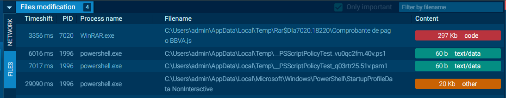

**Fase 2: Eksekusi Tersembunyi (Execution)**
Setelah file `.js` dieksekusi, script tersebut secara diam-diam mengambil antarmuka baris perintah. Menggunakan teknik *Living off the Land* (Lotl), proses memanggil `powershell.exe` dengan parameter `-ExecutionPolicy Bypass`. Tujuannya adalah untuk melewati kontrol keamanan bawaan Windows sehingga skrip dapat mengunduh muatan berbahaya (*payload*) dari *Command and Control* (C&C) server eksternal.

**Fase 3: Penyamaran dan Injeksi (Masquerading & Injection)**
Pada tahap akhir, *malware* tidak berjalan menggunakan nama aslinya untuk menghindari deteksi Antivirus/EDR. Seperti yang terlihat pada pohon proses (*Process Tree*) di bawah ini, eksekusi berujung pada pemanggilan utilitas sistem Windows yang sah, yaitu `CasPol.exe`. *Malware* menyuntikkan muatan berbahayanya ke dalam proses tersebut (terlihat dari tag merah dan label **AgentTesla** pada PID 3744), yang sekaligus mengonfirmasi bahwa proses ini telah dibajak untuk memulai aktivitas pencurian kredensial.

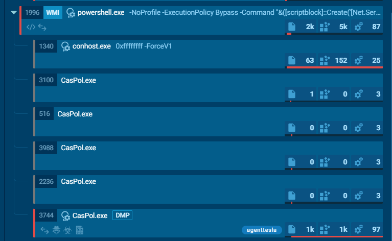

## 3. Execution & Process Tree

Berdasarkan hasil pemantauan pada *sandbox* ANY.RUN, eksekusi sampel ini menghasilkan pohon proses (*process tree*) yang kompleks. Terdapat transisi yang jelas dari proses ekstraksi awal, pemanggilan aplikasi bawaan sistem (Lotl), hingga tahap injeksi *payload* berbahaya. 

Berikut ini adalah rincian proses berdasarkan rantai eksekusi yang terbentuk:

**1. Tahap Ekstraksi (WinRAR)**
Proses dimulai ketika pengguna mengekstrak arsip dari *desktop*. Aplikasi WinRAR berjalan untuk mengekstrak dan menjatuhkan file JavaScript tersembunyi ke dalam direktori *temporary*.
* **Process Name:** `WinRAR.exe`
* **Path:** `C:\Program Files\WinRAR\WinRAR.exe`
* **Command Line:** `WinRAR.exe "C:\Users\admin\Desktop\Comprobante de pago BBVA.rar"`

**2. Eksekusi Dropper (Windows Script Host)**
Sistem menggunakan Windows Script Host untuk mengeksekusi file JavaScript yang telah diekstrak. Ini adalah titik masuk yang memicu rantai infeksi selanjutnya.
*   **Process Name:** `wscript.exe`
*   **Path:** `C:\Windows\System32\wscript.exe`
*   **Command Line:** `wscript.exe "C:\Users\admin\AppData\Local\Temp\Rar$DIa7020.18220\Comprobante de pago BBVA.js"`

**3. Panggilan PowerShell (execution & Evasion)**
Skrip `.js` memicu eksekusi PowerShell dengan parameter *bypass* yang spesifik. Tujuannya adalah untuk menonaktifkan fitur perlindungan skrip bawaan Windows (*ExecutionPolicy*) sehingga *malware* dapat menjalankan perindah lanjutan di latar belakang tanpa hambatan.
*   **Process Name:** `powershell.exe`
*   **Path:** `C:\Windows\System32\WindowsPowerShell\v1.0\powershell.exe`
*   **Command Line:** `powershell.exe -NoProfile -ExecutionPolicy Bypass -Command "&([scriptblock]::Create('[Net.Ser..."`

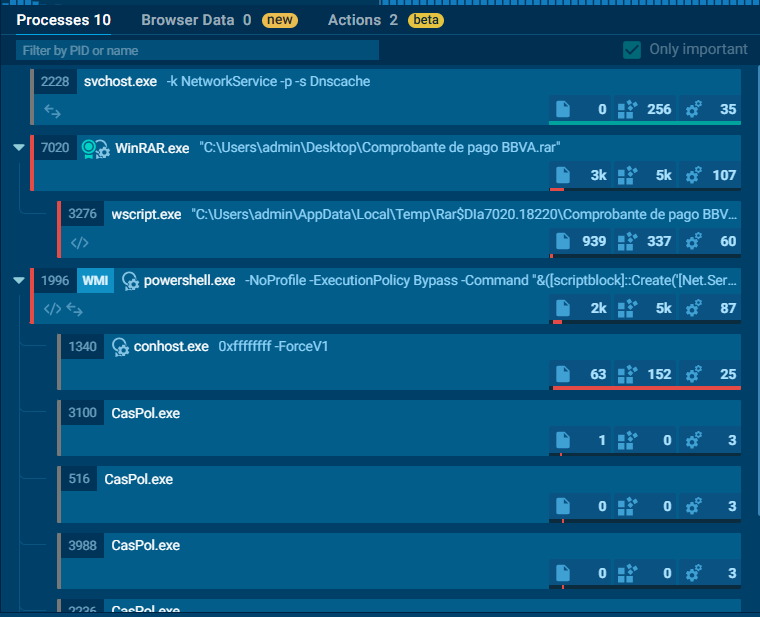

Berikut ini adalah visualisasi dari rantai proses (*process tree*) yang terbentuk:
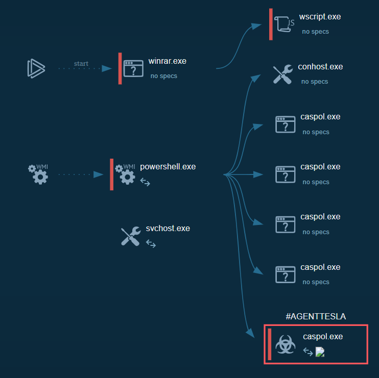

**4. Injeksi Payload & Penyamaran (Process Injection)**
Setelah PowerShell mengeksekusi muatan tambahan, *malware* memanggil beberapa *instance* dari `CasPol.exe` (Code Access Security Policy Tool) dan menyuntikkan kode berbahayanya ke dalam PID 3744. Proses ini dibajak untuk menyembunyikan aktivitas pencurian data (berjalan sebagai AgentTesla).
*   **Process Name:** `CasPol.exe`
*   **Path:** `C:\Windows\Microsoft.NET\Framework\v4.0.30319\CasPol.exe`
*   **Command Line:** `CasPol.exe`

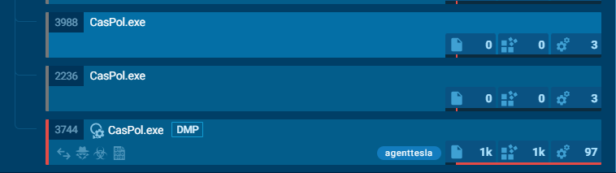

## 4. MITRE ATT&CK Framework Mapping

Berdasarkan hasil pemantauan dinamis pada *sandbox* ANY.RUN, sistem berhasil merekam rekapitulasi aktivitas jahat dari sampel AgentTesla ini dengan sangat komprehensif. Secara keseluruhan, pemetaan kerangka kerja MITRE ATT&CK mencatat adanya **63 Events** (bukti rekaman aktivitas mencurigakan/berbahaya), yang diklasifikasikan ke dalam **14 Techniques** (teknik spesifik yang digunakan), dan tersebar di **5 Tactics** (tujuan utama serangan).

Pemetaan kuantitatif ini menunjukkan secara gamblang tahapan yang dilalui *malware*, mulai dari cara penyerang mengeksekusi *payload*, menghindari deteksi, memindai sistem, hingga tahap akhir yaitu mencuri dan mengeksfiltrasi kredensial korban. Berikut adalah rincian analisis dari kelima taktik utama tersebut beserta teknik-teknik krusial yang menyertainya:

Berikut adalah rincian analisis dari taktik-taktik utama tersebut beserta teknik-teknik krusial yang menyertainya:

### 1. Execution (TA0002)

Taktik eksekusi berfokus pada bagaimana penyerang menjalankan kode berbahaya di dalam sistem korban. Berdasarkan hasil pemantauan matriks MITRE ATT&CK, berikut adalah teknik-teknik yang berhasil dideteksi beserta rincian *Technique ID*, *Technique Name*, deskripsi, dan aktivitas (*Events*) di baliknya:

*   **T1047 - Windows Management Instrumentation**
    *   **Description:** Penyerang menyalahgunakan fitur administrasi bawaan WMI untuk mengeksekusi perintah, mengontrol sistem, dan memindai lingkungan secara tersembunyi tanpa memicu peringatan sistem.
    *   **Events Record & Explanation:**
    
    | Indikator | Aktivitas Terdeteksi (*Events*) | Penjelasan | Proses (PID) |
    | :--- | :--- | :--- | :--- |
    | 🔴 **Danger** | *May hide the program window using WMI (SCRIPT)* | Menyembunyikan jendela program secara paksa agar aktivitas *malware* tidak terlihat di layar korban. | `wscript.exe` (3276) |
    | 🟡 **Warning** | *Executed via WMI* | Mengeksekusi proses lanjutan secara diam-diam melalui layanan WMI. | `powershell.exe` (1996) |
    | 🟡 **Warning** | *Creates an object to access WMI (SCRIPT)* | Membuat objek pemrograman untuk mulai mengakses infrastruktur WMI. | `wscript.exe` (3276) |
    | 🟡 **Warning** | *Uses WMI to retrieve WMI-managed resources (SCRIPT)* | Mengambil sumber daya dan informasi sistem yang dikelola oleh WMI. | `wscript.exe` (3276) |
    | 🟡 **Warning** | *Accesses WMI object caption (SCRIPT)* | Mengakses label atau judul dari objek WMI tertentu. | `wscript.exe` (3276) |
    | 🟡 **Warning** | *Accesses system date via WMI (SCRIPT)* | Memeriksa informasi tanggal yang sedang aktif pada sistem komputer korban. | `wscript.exe` (3276) |
    | 🟡 **Warning** | *Accesses computer name via WMI (SCRIPT)* | Mengambil informasi nama perangkat/komputer yang sedang diserang. | `wscript.exe` (3276) |
    | 🟡 **Warning** | *Accesses current user name via WMI (SCRIPT)* | Mengidentifikasi nama akun pengguna (*username*) yang sedang aktif digunakan. | `wscript.exe` (3276) |
    | 🟡 **Warning** | *Executes WMI query (SCRIPT)* | Menjalankan kueri perintah berbasis WMI ke dalam sistem. | `wscript.exe` (3276) |

*   **T1059 - Command and Scripting Interpreter**
    *   **Description:** Ancaman ini memanfaatkan *interpreter* baris perintah bawaan sistem (dalam hal ini PowerShell) untuk mengurai dan menjalankan argumen skrip lanjutan.
    *   **Events Record & Explanation:**
    
    | Indikator | Aktivitas Terdeteksi (*Events*) | Penjelasan | Proses (PID) |
    | :--- | :--- | :--- | :--- |
    | 🟡 **Warning** | *Found IP address in command line* | Menemukan adanya alamat IP eksternal yang disisipkan di dalam argumen baris perintah. | `powershell.exe` (1996) |

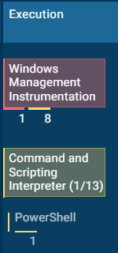

### 2. Defense Evasion (TA0005)

Taktik penghindaran pertahanan (*Defense Evasion*) mencakup berbagai metode yang digunakan oleh penyerang untuk menghindari deteksi oleh produk keamanan (seperti Antivirus, EDR, atau sistem pemantauan). Berdasarkan hasil analisis, *malware* ini menyembunyikan logika serangannya melalui teknik-teknik berikut:

*   **T1027 - Obfuscated Files or Information (termasuk Sub-teknik T1027.010 - Command Obfuscation)**
    *   **Description:** Penyerang sengaja mengaburkan bentuk file, skrip, atau perintah baris (*command line*) agar tidak mudah dibaca oleh analis maupun dideteksi oleh filter keamanan otomatis.
    *   **Events Record & Explanation:**
    
    | Indikator | Aktivitas Terdeteksi (*Events*) | Penjelasan | Proses (PID) |
    | :--- | :--- | :--- | :--- |
    | 🟡 **Warning** | *Obfuscation pattern (POWERSHELL)* | Ditemukan pola penyamaran/pengaburan kode di dalam perintah eksekusi PowerShell. | `powershell.exe` (1996) |

*   **T1140 - Deobfuscate/Decode Files or Information**
    *   **Description:** *Malware* sering kali mengenkode atau mengenkripsi komponen kodenya, lalu melakukan dekode secara otomatis sesaat sebelum dijalankan di dalam memori agar lolos dari pemindaian statis.
    *   **Events Record & Explanation:**
    
    | Indikator | Aktivitas Terdeteksi (*Events*) | Penjelasan | Proses (PID) |
    | :--- | :--- | :--- | :--- |
    | 🟡 **Warning** | *Uses base64 encoding* | Memanfaatkan teknik enkoding Base64 untuk menyembunyikan payload skrip di dalam perintah. | `powershell.exe` (1996) |

*   **T1562 - Impair Defenses**
    *   **Description:** Upaya aktif dari *malware* untuk melumpuhkan, melemahkan, atau mematikan fitur pemantauan keamanan pada sistem operasi korban.
    *   **Events Record & Explanation:**
    
    | Indikator | Aktivitas Terdeteksi (*Events*) | Penjelasan | Proses (PID) |
    | :--- | :--- | :--- | :--- |
    | 🔵 **Info/Tag** | *Disables trace logs* | Mematikan atau menonaktifkan pencatatan log jejak sistem (*trace logs*) untuk menghilangkan jejak aktivitas forensik. | `CasPol.exe` (3744) |

*   **T1564 - Hide Artifacts**
    *   **Description:** Menyembunyikan artefak atau komponen proses yang sedang berjalan dari pengamatan pengguna maupun administrator sistem.
    *   **Events Record & Explanation:**
    
    | Indikator | Aktivitas Terdeteksi (*Events*) | Penjelasan | Proses (PID) |
    | :--- | :--- | :--- | :--- |
    | 🔴 **Danger** | *Hidden Window* (May hide the program window using WMI) | Menjalankan proses secara tersembunyi tanpa memunculkan jendela antarmuka (*windowless*). | `wscript.exe` (3276) |

> **Catatan Karakteristik Obfuscation Tambahan:** 
> Berdasarkan indikator sistem secara keseluruhan, sampel ini juga didukung oleh berbagai mekanisme perlindungan tambahan seperti *Software Packing*, *Dynamic API Resolution*, *Fileless Storage*, hingga *Compression* untuk mempersulit proses *reverse engineering* oleh analis keamanan.

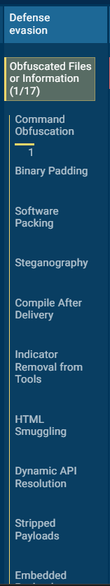
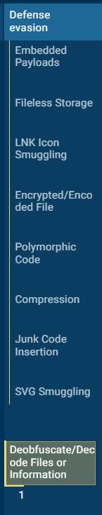
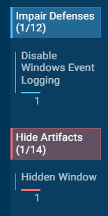

### 3. Credential Access (TA0006)

Taktik akses kredensial berfokus pada upaya *malware* untuk mendapatkan informasi autentikasi secara ilegal, seperti *password*, token, atau data pribadi yang tersimpan di dalam sistem. Pada tahap ini, proses yang telah dibajak (`CasPol.exe`) mulai melancarkan aksi pencurian data:

*   **T1552 - Unsecured Credentials (termasuk Sub-teknik T1552.001 - Credentials In Files)**
    *   **Description:** *Malware* menargetkan dan membaca file-file sistem atau aplikasi yang menyimpan kredensial sensitif secara tidak aman (seperti profil peramban, basis data email, atau file konfigurasi lokal).
    *   **Events Record & Explanation:**
    
    | Indikator | Aktivitas Terdeteksi (*Events*) | Penjelasan (Bahasa Indonesia) | Proses (PID) |
    | :--- | :--- | :--- | :--- |
    | 🔴 **Danger** | *Possible stealing of email data (7 events)* | Terdeteksi 7 aktivitas mencurigakan yang mengindikasikan upaya pembacaan dan pencurian data dari klien email korban. | `CasPol.exe` (3744) |
    | 🔴 **Danger** | *Actions looks like stealing of personal data (4 events)* | Terdeteksi 4 aktivitas yang menunjukkan pola pengambilan data pribadi atau dokumen sensitif pengguna. | `CasPol.exe` (3744) |

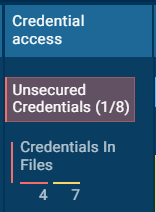

### 4. Discovery (TA0007)

Taktik pengintaian (*Discovery*) digunakan oleh *malware* untuk mengumpulkan informasi mendetail tentang sistem yang baru saja diinfeksi. Hal ini bertujuan agar perangkat lunak berbahaya dapat menyesuaikan diri dengan lingkungan target dan mengetahui letak file atau konfigurasi penting.

*   **T1012 - Query Registry**
    *   **Description:** *Malware* melakukan pembacaan terhadap basis data *Registry* Windows untuk mengetahui informasi identitas mesin, kebijakan keamanan peramban, hingga konfigurasi perangkat lunak yang terpasang.
    *   **Events Record & Explanation:**
    
    | Indikator | Aktivitas Terdeteksi (*Events*) | Penjelasan (Bahasa Indonesia) | Proses (PID) |
    | :--- | :--- | :--- | :--- |
    | 🔵 **Info/Tag** | *Reads the machine GUID from the registry* | Membaca nomor identifikasi unik mesin (*Machine GUID*) dari *registry*. | `CasPol.exe` (3744) |
    | 🔵 **Info/Tag** | *Reads security settings of Internet Explorer (15 events)* | Membaca konfigurasi atau pengaturan keamanan peramban Internet Explorer. | `WinRAR.exe` (4), `powershell.exe` (5), `CasPol.exe` (6) |
    | 🔵 **Info/Tag** | *Reads the computer name* | Membaca nama perangkat komputer yang sedang digunakan. | `CasPol.exe` (3744) |
    | 🔵 **Info/Tag** | *Checks supported languages* | Memeriksa pengaturan bahasa yang didukung oleh sistem operasi korban. | `CasPol.exe` (3744) |
    | 🔵 **Info/Tag** | *Reads Microsoft Office registry keys* | Membaca kunci *registry* yang berkaitan dengan aplikasi Microsoft Office. | `WinRAR.exe` (7020) |

*   **T1016 - System Network Configuration Discovery**
    *   **Description:** Memindai konfigurasi jaringan pada perangkat korban untuk mendeteksi domain, alamat IP, atau antarmuka jaringan yang aktif.

*   **T1082 - System Information Discovery**
    *   **Description:** Mengumpulkan informasi dasar tentang perangkat keras, sistem operasi, dan spesifikasi mesin yang terinfeksi.
    *   **Events Record & Explanation:**
    
    | Indikator | Aktivitas Terdeteksi (*Events*) | Penjelasan (Bahasa Indonesia) | Proses (PID) |
    | :--- | :--- | :--- | :--- |
    | 🔵 **Info/Tag** | *Reads the machine GUID from the registry* | Mengambil data GUID mesin untuk profil identifikasi perangkat. | `CasPol.exe` (3744) |
    | 🔵 **Info/Tag** | *Reads the computer name* | Mengambil informasi nama host komputer korban. | `CasPol.exe` (3744) |
    | 🔵 **Info/Tag** | *Checks supported languages* | Mengidentifikasi preferensi bahasa lokal pada sistem. | `CasPol.exe` (3744) |
    | 🟡 **Warning** | *Accesses computer name via WMI (SCRIPT)* | Mengakses nama komputer secara terprogram menggunakan skrip WMI. | `wscript.exe` (3276) |
    | 🟡 **Warning** | *Accesses current user name via WMI (SCRIPT)* | Mengakses nama pengguna yang sedang aktif melalui WMI. | `wscript.exe` (3276) |

*   **T1124 - System Time Discovery**
    *   **Description:** Memeriksa informasi waktu atau zona waktu sistem untuk menyelaraskan sinkronisasi log atau penjadwalan komunikasi.
    *   **Events Record & Explanation:**
    
    | Indikator | Aktivitas Terdeteksi (*Events*) | Penjelasan (Bahasa Indonesia) | Proses (PID) |
    | :--- | :--- | :--- | :--- |
    | 🟡 **Warning** | *Accesses system date via WMI (SCRIPT)* | Memeriksa tanggal sistem operasi yang sedang berjalan melalui WMI. | `wscript.exe` (3276) |

*   **T1518 - Software Discovery**
    *   **Description:** Melakukan pemindaian tingkat lanjut untuk mendeteksi perangkat lunak, utilitas, atau program keamanan apa saja yang terinstal di dalam komputer korban (ditandai dengan tingkat ancaman merah).

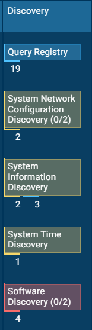

### 5. Command and Control / C&C (TA0011)

Taktik *Command and Control* mencakup bagaimana *malware* berkomunikasi dengan infrastruktur eksternal milik penyerang untuk mengirimkan data hasil curian (*exfiltration*) atau menerima instruksi lanjutan. Berdasarkan hasil analisis, AgentTesla menggunakan protokol lapisan aplikasi standar untuk menyelundupkan data keluar jaringan korban:

*   **T1071 - Application Layer Protocol (termasuk Sub-teknik T1071.002 - File Transfer Protocols)**
    *   **Description:** *Malware* memanfaatkan protokol lapisan aplikasi standar (seperti FTP, HTTP, Mail, atau DNS) untuk menyamarkan lalu lintas data berbahaya agar tampak seperti aktivitas jaringan yang sah.
    *   **Events Record & Explanation:**
    
    | Indikator | Aktivitas Terdeteksi (*Events*) | Penjelasan (Bahasa Indonesia) | Proses (PID) |
    | :--- | :--- | :--- | :--- |
    | 🟡 **Warning** | *Connects to FTP* | Membuka koneksi keluar (*outgoing connection*) menggunakan protokol FTP untuk mengirimkan rekap data curian ke server C&C penyerang. | `CasPol.exe` (3744) |

*   **T1132 - Data Encoding (termasuk Sub-teknik T1132.001 - Standard Encoding & T1132.002 - Non-Standard Encoding)**
    *   **Description:** Mengubah format atau menyandikan data sebelum dikirimkan ke luar jaringan agar bentuknya tersamar dan tidak mudah dibaca oleh sistem pemantauan lalu lintas jaringan (*Deep Packet Inspection*).
    *   **Events Record & Explanation:**
    
    | Indikator | Aktivitas Terdeteksi (*Events*) | Penjelasan (Bahasa Indonesia) | Proses (PID) |
    | :--- | :--- | :--- | :--- |
    | 🔵 **Info/Tag** | *Converts byte array into ASCII string (POWERSHELL)* | Mengonversi deretan *byte* data mentah menjadi bentuk teks string ASCII standar di dalam memori skrip. | `powershell.exe` (1996) |
    | 🔵 **Info/Tag** | *Uses base64 encoding (POWERSHELL)* | Menerapkan enkoding Base64 untuk membungkus muatan atau parameter perintah PowerShell. | `powershell.exe` (1996) |

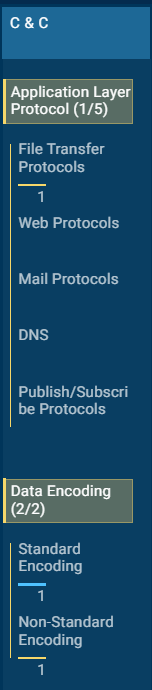

Berikut ini adalah ringkasan analisis perilaku sampel ini yang memicu beberapa taktik dan teknik MITRE ATT&CK:

| Tactic | Technique ID | Technique Name | Description / Event |
| :--- | :--- | :--- | :--- |
| **Execution** | **T1047** | Windows Management Instrumentation | Menyalahgunakan layanan WMI (`wscript.exe`) untuk menyembunyikan jendela program secara tersembunyi dan memindai lingkungan sistem. |
| **Execution** | **T1059.001** | Command and Scripting Interpreter: PowerShell | Memanfaatkan *interpreter* PowerShell dengan parameter *bypass* untuk menjalankan skrip lanjutan di dalam memori. |
| **Defense Evasion** | **T1027** | Obfuscated Files or Information | Mengaburkan bentuk perintah dan skrip (*command obfuscation*) untuk menghindari deteksi statis. |
| **Defense Evasion** | **T1140** | Deobfuscate/Decode Files or Information | Memanfaatkan enkoding Base64 untuk menyembunyikan payload skrip. |
| **Defense Evasion** | **T1562** | Impair Defenses | Melumpuhkan pencatatan log jejak sistem (*trace logs*) melalui proses `CasPol.exe`. |
| **Defense Evasion** | **T1564** | Hide Artifacts | Menjalankan proses secara tersembunyi tanpa memunculkan jendela antarmuka (*hidden window*). |
| **Credential Access** | **T1552.001** | Unsecured Credentials: Credentials In Files | Menargetkan dan membaca file-file sistem atau klien email untuk mencuri data sensitif dan kredensial korban. |
| **Discovery** | **T1012** | Query Registry | Membaca pengaturan keamanan (seperti Internet Explorer, pengaturan bahasa, dan konfigurasi Microsoft Office). |
| **Discovery** | **T1082** | System Information Discovery | Mengumpulkan informasi dasar tentang perangkat, nama komputer, serta GUID mesin. |
| **Discovery** | **T1124** | System Time Discovery | Memeriksa informasi tanggal dan zona waktu sistem melalui skrip WMI. |
| **Discovery** | **T1518** | Software Discovery | Melakukan pemindaian untuk mendeteksi perangkat lunak atau program keamanan yang terpasang di sistem. |
| **Command and Control** | **T1071.002** | Application Layer Protocol: File Transfer Protocols | Membuka koneksi keluar (*outbound*) menggunakan protokol FTP untuk mengeksfiltrasi data curian ke server penyerang. |
| **Command and Control** | **T1132** | Data Encoding | Mengonversi data ke format string ASCII dan Base64 untuk menyamarkan komunikasi jaringan. |

## 5. Indicators of Compromise (IoC) & Indicators of Attack (IoA)

**Host-Based Indicators (IoA/IoC):**
**Modified Registry Keys:** Terdapat modifikasi dan pencatatan riwayat pada *registry* untuk memantau artefak file arsip umpan, seperti pada kunci `HKEY_CURRENT_USER\SOFTWARE\WINRAR\ArcHistory` yang mencatat file `Comprobante de pago BBVA.rar`.
**Process Anomaly:** Rantai proses mencurigakan dimulai dari ekstraksi arsip via `WinRAR.exe`, eksekusi skrip melalui `wscript.exe`, pemanggilan `powershell.exe` untuk pengunduhan muatan terselubung, hingga pembajakan proses sah .NET melalui injeksi ke dalam `CasPol.exe` (PID 3744) tanpa pemanggilan aktivitas legitimasi standar.

>Bukti Modifikasi Registry Keys:
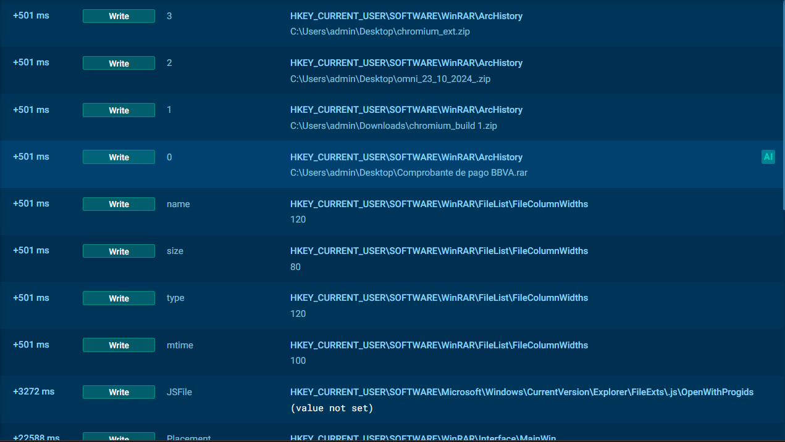

**Network-Based Indicators (IoC):**
**IP, Domain, dan URL:**
* **Domain:** `ftp[.]sanchezamador[.]com[.]mx`
* **IP Address:** `195[.]250[.]27[.]46` (C&C Server) dan `104[.]250[.]238[.]131` (Stager Server)
* **URL:** `hXXp[://]104[.]250[.]238[.]131/newMSI_PRO.png` dan `hXXp[://]104[.]250[.]238[.]131/niceimg_092217.png`

**Protocol:** FTP (Port 21) dan HTTP (Application Layer Protocol).

Bukti HTTP Requests (URL):
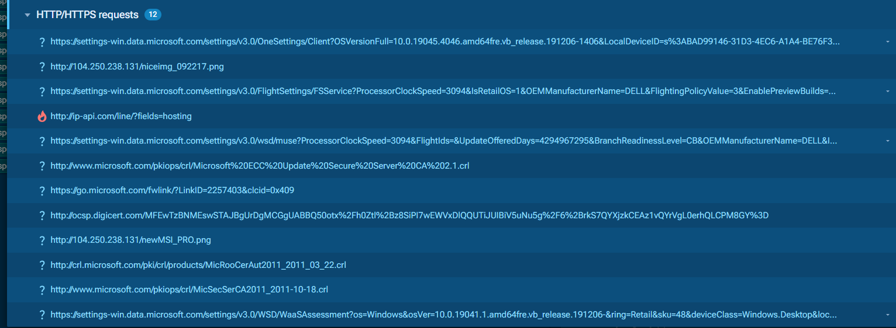

Bukti Connections IP & DNS (Domain):
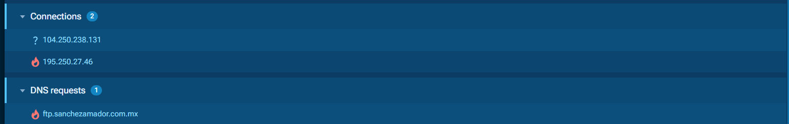

## 6. Recommendations & Mitigation

Berdasarkan analisis perilaku *malware* AgentTesla yang memanfaatkan teknik *process injection* dan eksfiltrasi data via FTP, berikut adalah rekomendasi mitigasi yang perlu diterapkan untuk mencegah dan menangani insiden serupa:

**1. Pengetatan Keamanan Endpoint (EDR & Kebijakan Eksekusi)**
*   **Pemantauan Process Injection:** Konfigurasikan *Endpoint Detection and Response* (EDR) untuk mendeteksi anomali pada proses bawaan sistem (LoLBin) seperti `CasPol.exe`, `RegSvcs.exe`, atau `MSBuild.exe`, terutama jika proses tersebut mulai mengakses *registry* sensitif atau membuka koneksi jaringan keluar secara tiba-tiba.
*   **Pembatasan Skrip (Scripting Restricton):** Terapkan kebijakan *ExecutionPolicy* yang ketat pada PowerShell (misalnya *Constrained Language Mode*) untuk memblokir parameter `-Bypass` dan `-Hidden`. Selain itu, cegah eksekusi otomatis skrip (seperti `.js`, `.vbs`, `.wsf`) dari aplikasi arsip maupun dari dalam direktori *temporary* pengguna.

**2. Pengamanan Lapisan Jaringan (Network Defense)**
*   **Pemblokiran IoC Jaringan:** Masukkan IP C&C (`195[.]250[.]27[.]46`), IP Stager (`104[.]250[.]238[.]131`), serta domain penyerang (`ftp[.]sanchezamador[.]com[.]mx`) ke dalam daftar blokir (*blacklist*) pada *firewall* atau *Secure Web Gateway* (SWG).
*   **Pembatasan Protokol FTP (Port 21):** Karena sampel ini menggunakan FTP teks terang (*plaintext*) untuk mengirimkan data curian, blokir semua lalu lintas FTP keluar (*outbound*) dari jaringan internal, kecuali ke alamat tujuan spesifik yang memang memiliki izin bisnis (izin berbasis *whitelist*).

**3. Perlindungan Kredensial & Manajemen Akses**
*   **Rotasi Password & MFA:** Mengingat AgentTesla adalah *infostealer*, asumsikan bahwa kredensial di perangkat yang terinfeksi telah dikompromikan. Segera lakukan reset *password* untuk akun email, FTP, dan aplikasi *web* milik pengguna, serta wajibkan penggunaan *Multi-Factor Authentication* (MFA).
*   **Batasi Penyimpanan Kredensial:** Terapkan kebijakan grup (GPO) yang melarang pengguna untuk menyimpan kata sandi langsung di dalam peramban (*web browser*), dan anjurkan penggunaan *Password Manager* pihak ketiga yang terenkripsi (membutuhkan *Master Password*).

**4. Keamanan Email & Kesadaran Pengguna**
*   **Penyaringan Email Gateways:** Terapkan pemfilteran ekstensi file agresif di *email gateway* untuk memblokir lampiran arsip (seperti `.rar`, `.zip`, atau `.cab`) yang terdeteksi membungkus *file* eksekusi (PE) atau skrip berbahaya.